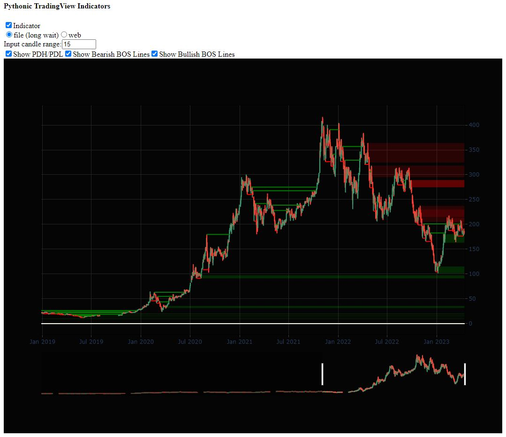

## TradeView Indicator
This program is the result of a test task  
It is a TradeView Indicator translated to Python from Pine Script  
Install all packages:
```
pip install -r requirements.txt
```
Run program:
```
py main.py
```
You will see message like:
```shell
Dash is running on http://127.0.0.1:8050/
```
Click the link, it will open page in browser.  
Screen:
